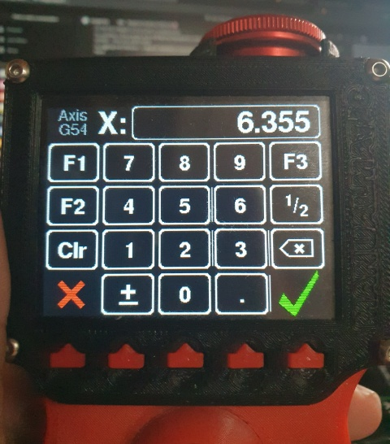

# TouchScreenEvents
A TouchScreen library that implements all the [InputEvents::EventButton](https://github.com/Stutchbury/InputEvents/blob/main/docs/EventButton.md) events plus `DRAG` & `DRAGGED` in response to user interaction.

This library is part of the [InputEvents](https://github.com/Stutchbury/InputEvents) family (and is `namespace`d as such) bringing `EventButton` [events](https://github.com/Stutchbury/InputEvents/blob/main/docs/InputEventTypes.md) to the touch screen. 

The `EventTouchScreen` is the heart of the library, using a `TouchScreenAdapter` to provide a unified interface via a thin adapter for each underlying touch screen library (pull requests welcome).

In addition, `Region`s and a Widgets are provided, enabling extensive manipulation of rectangular screen areas including a widget base class and specialised touch, button label (for physical buttons), event and virtual pin (to 'virtually' press/release a linked physical button from the touch screen) specialised widget mixins. There is also a widget container, a widget row container and last but not least, a touch keypad widget!

All of this is display driver agnostic - that is, although a `draw()` method is specified in the base widget interface, all drawing is implemented in concrete widget classes using your favourite GFX library.

This is a concrete implementation of the `BaseTouchKeypadWidget`. The ❌ and ✔️ each respond to both touch *and* the physical buttons below them.
The screen buttons provide visual feedback when pressed.

(This screen is part of the ManualmaticLib project. I will link to the source when I have published it - if you can't wait, chat with me on [Discord](https://discord.gg/GDcEcWPKKm)...)

The touch interactions work very well on capacitive touch panels and better than expected on resistive ones! For everyone accustomed to phone screens, the resistive panel is a particular challenge and for that reason a 'debouncer' (who'd have thought you'd need that?) is included. Refining with `EventTouchScreen::setDebounceInterval()` can dramatically improve the behaviour of resistive touch panels.

# SUPPORT

Feedback, [bug reports](https://github.com/Stutchbury/TouchScreenEvents/issues) and pull requests are very welcome or chat on [Discord](https://discord.gg/GDcEcWPKKm) if you have any questions.

Whilst this library is fully functional and broadly tested, it is still a work in progress, so there may be API changes. 

Note: The `IEventScreen` and `EventScreenManager` are not currently available for AVR boards (no `std` library support).
